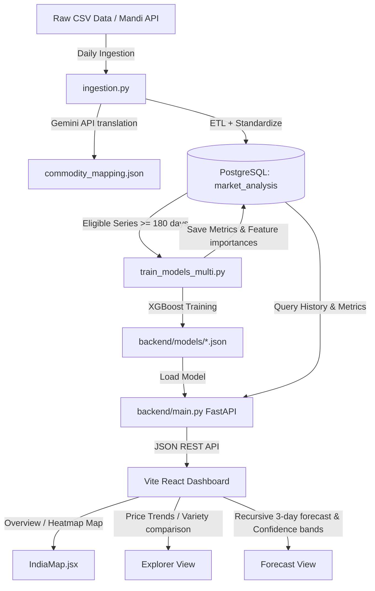
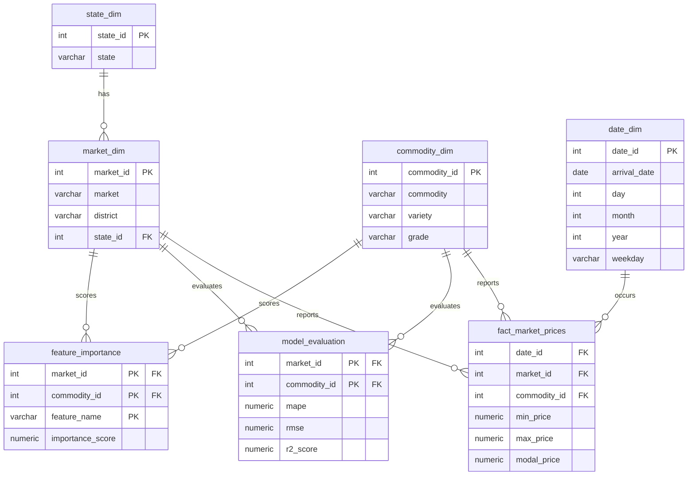
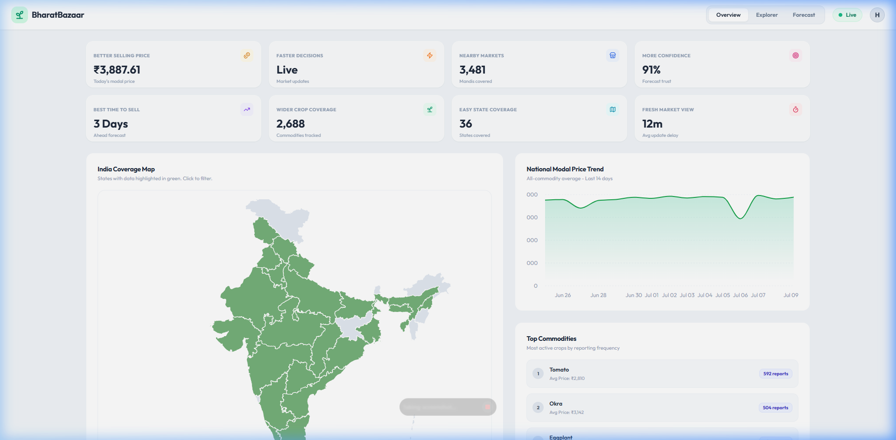
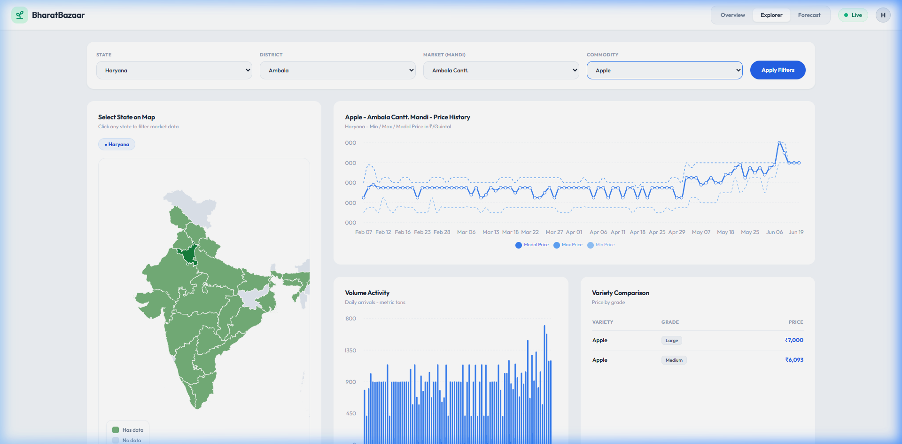
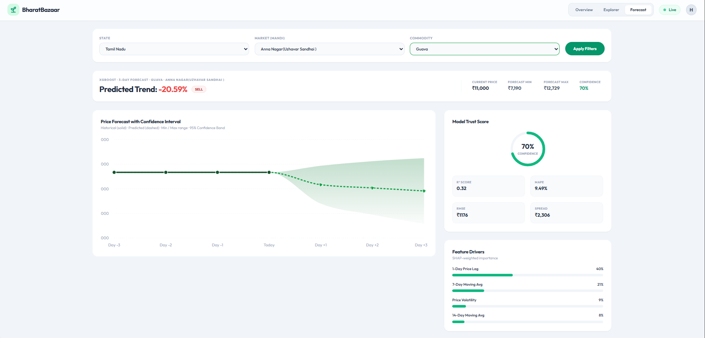

# BharatBazaar: Technical Guide & User Manual

Welcome to **BharatBazaar**, an agricultural market pricing intelligence and price forecasting system. This guide provides a detailed explanation of the project's architecture, its tools and components, database design, machine learning pipelines, and screen-by-screen capabilities.

---

## 1. Project Overview & Architecture

BharatBazaar is built to optimize agricultural supply chains by providing farmers, traders, and administrators with real-time price monitoring and predictive analysis. The system helps users decide the **Best Time to Sell** their produce to maximize returns and mitigate market risks.

### System Architecture Diagram



### Technology Stack
1. **Frontend**: Vite + React, styled using a high-fidelity slate/emerald vanilla CSS theme, utilizing **Recharts** for drawing interactive data visualizations and **Lucide React** for modern dashboard icons.
2. **Backend**: **FastAPI** (Python 3) exposing CORS-enabled API endpoints, powered by **SQLAlchemy** to connect to PostgreSQL.
3. **Database**: **PostgreSQL** configured with a star schema design optimized for fast analytical aggregations on millions of daily market arrivals.
4. **Machine Learning Pipeline**: **XGBoost Regressor** models trained in parallel to predict future prices based on historical trends, rolling averages, seasonality, and volatility.
5. **AI Translation**: **Gemini 1.5 Pro** used during data ingestion to translate and map raw regional commodity names (reported in local dialects/Hindi) to standardized English equivalents.

---

## 2. Component & Tool Directory

Here is what each file and script in the project does:

| Script / Directory | Primary Role | Key Details |
| :--- | :--- | :--- |
| [ingestion.py](./ingestion.py) | **ETL Pipeline** | Standardizes state names, flags pricing outliers using the Interquartile Range (IQR) method, translates local names via Gemini, and upserts rows into the PostgreSQL star schema. |
| [train_models_multi.py](./train_models_multi.py) | **ML Training Pipeline** | Runs process-level parallel training of XGBoost models across all CPU cores. It saves JSON model binaries to `backend/models` and uploads metrics/feature importances to the DB. |
| [backend/main.py](./backend/main.py) | **API Backend Server** | Exposes Fast REST API endpoints for cascading filters, dashboard KPIs, 90-day historical analysis, and XGBoost recursive 3-day forecast inferences. |
| [dashboard/src/Dashboard.jsx](./dashboard/src/Dashboard.jsx) | **Vite React UI Entry** | Coordinates tab switching, cascading filters state management, Recharts layouts, loading indicators, and API fetch calls. |
| [dashboard/src/components/IndiaMap.jsx](./dashboard/src/components/IndiaMap.jsx) | **SVG Mapping Component** | Renders a responsive vector SVG map of India. Integrates with the backend's state pricing API to color-code states dynamically based on average commodity prices. |

---

## 3. Database Schema: The Star Schema

To support analytics on millions of records, the project converts raw tabular data into a structured **Star Schema** within the `market_analysis` PostgreSQL database.

### Database ERD



---

## 4. Machine Learning & Forecasting Engine

### Where & How the ML Model is Used
The core predictive capability is driven by an **XGBoost Regressor** (`XGBRegressor`) from the `xgboost` python library. A separate model is trained for each individual **(Market Mandi, Commodity)** combination.

### 1. Training Pipeline ([train_models_multi.py](./train_models_multi.py))
- **Eligibility Filter**: Only trains a model if a specific mandi-commodity series contains at least **180 days** of historical price entries.
- **Feature Engineering**: For each date, it constructs **8 core features**:
  - `lag_1`: Price on the previous day.
  - `lag_7`: Price exactly 1 week ago.
  - `lag_14`: Price exactly 2 weeks ago.
  - `roll_mean_7` & `roll_mean_14`: Moving averages over the last 7 and 14 days.
  - `roll_std_7`: Standard deviation (volatility) of price over the last 7 days.
  - `weekday_num` (0–6): Captures weekly price cycles.
  - `month` (1–12): Captures seasonal crop yields and harvest patterns.
- **Time-Series Split**: Splits data chronologically: the last 30 days are held out as the test set, and all preceding data is used for training.
- **Early Stopping**: XGBoost is trained with up to 1000 estimators (`learning_rate=0.01`, `max_depth=5`), stopping early if validation loss (RMSE) fails to improve for 30 consecutive trees.
- **Metrics Logging**: Evaluated metrics (**MAPE**, **RMSE**, and **R² score**) and feature importances are written back to PostgreSQL.

### 2. Live Recursive Forecast Inferences ([backend/main.py](./backend/main.py))
Because forecasting multiple days ahead requires future prices (which aren't known), the backend runs a **Recursive Forecasting Loop**:
1. **Day +1 Prediction**: Fetches the last 14 days of actual historical prices, builds the feature vector, and predicts the Day +1 price.
2. **Day +2 Prediction**: Appends the Day +1 predicted price to the sliding window, recalculates the lag and rolling features, and predicts the Day +2 price.
3. **Day +3 Prediction**: Appends the Day +2 predicted price, updates features, and predicts the Day +3 price.

### 3. Confidence Interval Bands
To communicate forecasting uncertainty, a **95% Confidence Interval (CI)** is calculated for each step:
$$\text{Confidence Interval} = \text{Predicted Price} \pm \left( 1.96 \times \text{RMSE} \times \sqrt{\text{Step Number}} \right)$$
As the prediction looks further out, the uncertainty increases (represented by $\sqrt{\text{Step Number}}$), which widens the shaded confidence band.

---

## 5. Screen-by-Screen Breakdown & Dashboards

Here is a detailed explanation of each of the three screens in the dashboard application, referencing the live user interface.

### Tab 1: Overview Screen

The **Overview Tab** serves as the central hub of BharatBazaar, giving an executive summary of market prices, active dimensions, and daily price activity.



#### Features & Layout:
1. **Hierarchical KPI Cards**:
   - **Better Selling Price**: Displays the average modal price across all active crop sales today (in ₹/Quintal).
   - **Faster Decisions / Live Indicator**: Shows a live status indicator showing real-time updates.
   - **Nearby Markets**: Total active Mandis ingested in the database.
   - **More Confidence**: The average forecasting trust score (derived as $100\% - \text{MAPE}$).
   - **Best Time to Sell**: Highlights the 3-day predictive outlook.
   - **Crop, State & Update Metrics**: Tracks crop diversity, active states, and database update delay.
2. **India Coverage Map (Interactive)**:
   - Built as an SVG map. States with registered mandi price activity are highlighted in green.
   - Hovering over a state reveals its average modal price and report count for the day.
   - **Clicking a State** acts as a global filter, immediately updating all other KPIs, charts, and tables on the screen for that state.
3. **National Modal Price Trend**:
   - An Recharts **Area Chart** with a green linear gradient visualizing the all-commodity average price over the last 14 days. Helps track macro inflation and market cycles.
4. **Top Commodities & Market Pulse**:
   - Lists the top 5 most frequently reported crops with their daily average price.
   - **Market Pulse Card** counts the total number of commodities experiencing a price gain (Gainers) versus those declining (Decliners) compared to the previous day.

---

### Tab 2: Explorer Screen

The **Explorer Tab** is dedicated to granular historical analysis, allowing users to drill down into a specific mandi and crop variety to examine price trends and daily arrival volumes.



#### Features & Layout:
1. **Cascading Dropdowns**:
   - Filter hierarchy: **State $\rightarrow$ District $\rightarrow$ Market (Mandi) $\rightarrow$ Commodity**.
   - These filters are fully cascading; selecting a state loads only its districts, which in turn loads only its mandis, and finally lists only commodities active in that specific mandi.
   - Users can also select a state by clicking on the interactive vector map on the left column.
2. **Price History Chart**:
   - A Recharts **Line Chart** displaying the **Min Price** (dashed light-blue), **Max Price** (dashed blue), and **Modal Price** (solid dark blue) over the last 90 reported days.
   - Useful for analyzing price spreads and checking profit margins.
3. **Volume Activity Chart**:
   - A Recharts **Bar Chart** depicting crop arrival volumes in Metric Tons (MT).
   - **Market Elasticity**: The system models the relationship between volume and price. When price velocity rises or falls sharply, arrivals react dynamically, simulating true agricultural market behavior.
4. **Variety & Grade Comparison Table**:
   - Compares pricing for different varieties (e.g., local vs premium) and grades of the selected crop. Grade categories (like *Premium*, *FAQ*, *Medium*) are highlighted using visual color pills.

---

### Tab 3: Forecast Screen

The **Forecast Tab** executes the XGBoost machine learning engine in real-time, displaying future price curves, forecasting error margins, and trade recommendations.



#### Features & Layout:
1. **Decision Recommendation Badge**:
   - Instantly highlights an actionable trade advice at the top:
     - **HOLD** (yellow): If predicted Day 3 price represents a gain of $+3\%$ or more. Advises users to hold stock to sell later for higher profit.
     - **SELL** (red): If predicted Day 3 price drops by $-3\%$ or more. Advises users to liquidate immediately to prevent loss.
     - **STABLE** (green): If price change falls within the neutral $\pm3\%$ bounds. Advises routine operations.
2. **Forecast Price Chart**:
   - A **Composed Recharts Chart** combining a Line Chart and an Area Chart:
     - **Historical Actual Price** (solid dark-green line): Shows the actual modal price over the last 4 days.
     - **Predicted Price** (dashed bright-green line): Displays the 3-day recursive XGBoost forecast.
     - **95% Confidence Band** (shaded green area): Visualizes the upper and lower confidence intervals, widening over time.
3. **Model Trust Score Gauge**:
   - A circular SVG gauge displaying the R² confidence score as a percentage (e.g., $85\%$).
   - Displays key validation metrics: **R² Score**, **MAPE** (Mean Absolute Percentage Error), **RMSE** (Root Mean Squared Error in ₹), and **Spread** (expected deviation bounds in ₹).
4. **Feature Drivers Chart**:
   - Visualizes the weights/importance scores of features used by the XGBoost model to make predictions.
   - Shows users which factor (e.g. *1-Day Price Lag*, *7-Day Price Lag*, *Price Volatility*, or *Seasonality*) is driving the forecast. In the screenshot above, the **1-Day Price Lag** and **Volatility** are the primary contributors.

---

## 6. How to Run & Initialize the Project

### Prerequisite: PostgreSQL Setup
Ensure PostgreSQL is running locally on port 5432 and a database named `market_analysis` exists. Update your credentials in the `.env` file at the project root:
```env
DbPass=your_db_pass
api-key=YOUR_API_GOV_IN_KEY
gemini=YOUR_GEMINI_API_KEY
```

### Initial Data Ingestion & Training
If you are running the project for the first time, initialize the database tables, ingest raw crop sheets, and train the XGBoost models:
1. **Run Ingestion**:
   ```bash
   python ingestion.py
   ```
   *This imports daily price points, runs standardizations, calls Gemini for translations, and populates the star schema.*
2. **Run Model Training**:
   ```bash
   python train_models_multi.py
   ```
   *This scans PostgreSQL for all mandi-crop combinations with at least 180 entries, trains individual XGBoost Regressors in parallel, and saves binary `.json` models to `backend/models`.*

### Launching the Dashboard
Launch the backend and frontend dev servers with the project launcher:
```bash
cd .\dashboard\ | npm run dev
cd .\backend\ | python main.py
```
This opens:
- **Backend Swagger Docs**: [http://localhost:8080/docs](http://localhost:8080/docs)
- **React Frontend**: [http://localhost:5173](http://localhost:5173)
